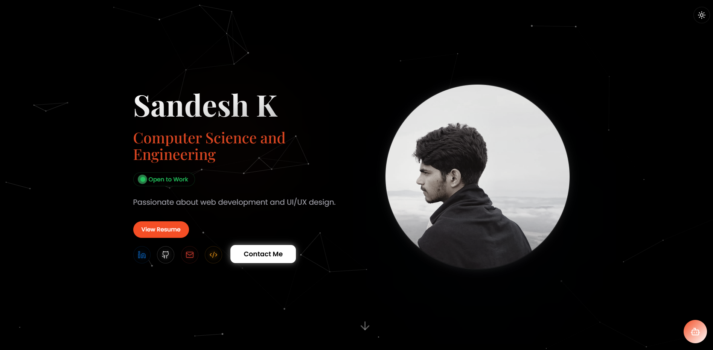

# 🚀 Sandesh's Portfolio
### Modern • Responsive • Interactive

*A next-gen portfolio built with **Vite**, **TailwindCSS**, and **TypeScript** — fast, sleek, and responsive.*

---

## 🎯 About

> **Crafting digital experiences with passion and precision**

I’m **Sandesh**, a developer from **Bengaluru** 🇮🇳, building modern web solutions that merge **creativity with performance**.  
This portfolio is my digital home — showcasing my journey, skills, and featured projects.

---

## 🌟 Key Highlights

<table>
<tr>
<td width="50%">

#### 🎨 **Design Excellence**
- Dark/Light theme support
- Smooth micro-interactions
- Pixel-perfect responsive design
- Mobile-first approach

</td>
<td width="50%">

#### ⚡ **Performance & Quality**
- Blazing-fast Vite build
- SEO & accessibility optimized
- Clean, scalable codebase
- Deployed on Vercel

</td>
</tr>
</table>

---

## 🛠️ Tech Stack

---

## 🏗️ Architecture

<pre>
📦 Frontend Stack
├── ⚡ Vite            → Fast bundling & dev server
├── 🎨 TailwindCSS     → Utility-first styling
├── 🔷 TypeScript      → Type safety & clean code
├── 🔧 PostCSS         → Advanced CSS processing
├── 📱 Responsive UI   → Mobile-first approach
└── ☁️ Vercel Deploy   → Seamless hosting
</pre>

---

## ✨ Features

🎯 <strong>Core Features</strong>

- Responsive, grid-based layout  
- Dark/Light theme toggle  
- Smooth scroll and animations  
- SEO-friendly meta setup  
- Accessibility compliant (WCAG)  
- Certificates & Resume section  

🚀 <strong>Interactive Elements</strong>

- Scroll reveal animations  
- Hover interaction effects  
- Mobile touch gestures  
- Dynamic content sections  
- Loading feedback animations  

---

## 📁 Project Structure

<pre>
portfolio/
├── 📄 index.html               → Main HTML entry
├── ⚙️ vite.config.ts            → Vite configuration
├── 🎨 tailwind.config.ts        → TailwindCSS config
├── 📦 package.json              → Project metadata & scripts
├── 📂 public/
│   ├── 📜 resume.pdf           → Resume
│   ├── 🖼️ certificates/        → Certificates
│   ├── 🖼️ projects/            → Project screenshots
│   ├── 📁 lovable-uploads/     → Assets
│   └── 📄 favicon.ico
└── 📂 src/
    ├── components/             → UI components
    ├── styles/                 → Global styles
    ├── scripts/                → App logic
    └── assets/                 → Local images/icons
</pre>

---

📌 Let's Connect

